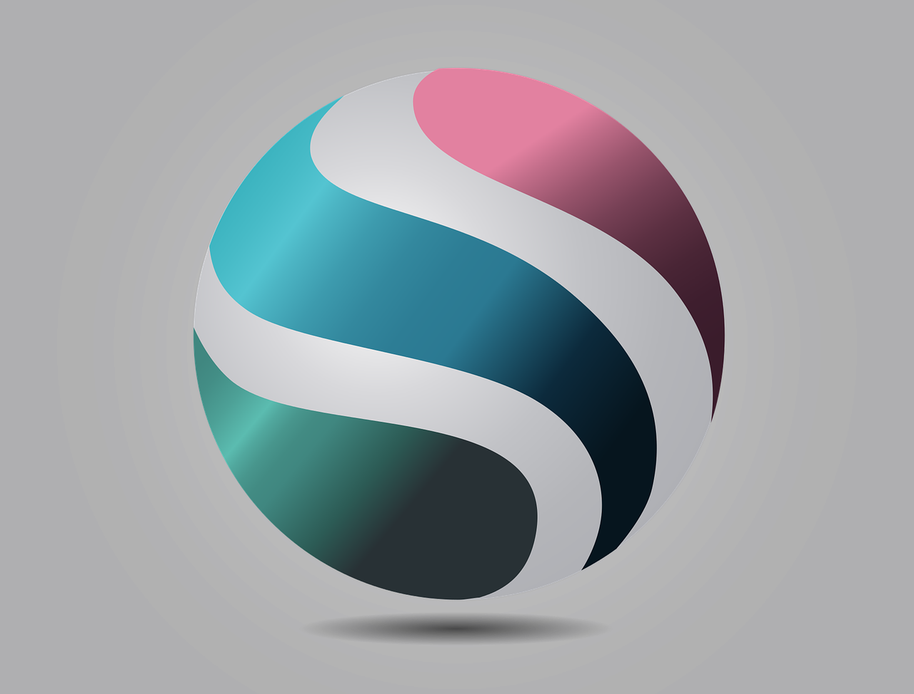

# Create app placeholder

1. `npx nuxi@latest init nuxt-dashboard-app`
2. `cd nuxt-dashboard-app`
3. `code .`
4. In built-in termintal run development server `npm run dev`
5. Dekete `app,vue` and create the folder `pages` in the root folder. Add `index.vue` and `about.vue` files in this folder.
6. In the `index.vue` file type `vbase-3-setup` autocompletion (Requires Vue VSCode Snippets extension) to create the template for the page. Remove `lang="scss"` from styling. Add basic content to the page like header and a few lorem paragraphs,
7. Repeat the same for `about.vue`
8. Under `pages` create folder `dashboards` with `index.vue` therein. Add basic header and paragraphs.
   9; Create file `[dashid].vue` under `dashboards`, which will represent an individual dashboard. Create basic page with `vbase-3-setup`.
9. Add this script:

```js
const { dashid } = useRoute().params;
```

11. Add this to the template part:

```html
<template>
    <div>
        <h1>Dashboard {{ dashid }}</h1>
        <p>Lorem ipsum dolor, sit amet consectetur adipisicing elit. Perspiciatis iusto vero rerum minus, nam at accusantium saepe. Consequuntur, tempora excepturi ipsum ipsa inventore autem quos error, minus aliquam nostrum odio.</p>
    </div>
</template>
```

12. Add navbar to `index.vue`:

```html
    <header>
        <nav>
            <ul>
                <li><NuxtLink to="/">Home</NuxtLink></li>
                <li><NuxtLink to="/about">About</NuxtLink></li>
                <li><NuxtLink  to="/dashboards">Dashboards</NuxtLink></li>
            </ul>
        </nav>
    </header>
```

13. Copy and paste the header tp all files. (Demonstration why people need layouts).

14. Create `layouts` folder in the root. Add `default.vue` in it. Copy and paste the content of the template section of `index.vue`. Replace the content under `<div>`  with `<slot />`. Remove headers from files.

15. Add this section to the layout:

```css
<style scoped>
    .router-link-exact-active {
        color: brown;
    }
</style>
```

15. Create another layout `footer-navbar` with navbar in the footer and add this to the `script` section:

```js
    definePageMeta({
        layout: 'footer-navbar'
    })
```

# Styling the appp with Tailwind
16. In the terminal install Tailwind `npm install --save-dev @nuxtjs/tailwindcss`. Run `npx tailwindcss init`. Add to `next.config.ts` the Tailwind module:

```ts
export default defineNuxtConfig({
  compatibilityDate: '2024-11-01',
  devtools: { enabled: true },
  modules: ['@nuxtjs/tailwindcss']
})
```

17. In the `default.vue` layout edit header and div sections by additng `class=""` in respective markup to style Home and About pages. Refer to [Tailwind Cheat Sheet](https://nerdcave.com/tailwind-cheat-sheet).

**NOTE:** If you ever run into `ERROR: System limit for number of file watchers reached in Nuxt`, increase the number of watchers using these commands

```bash
echo fs.inotify.max_user_watches=524288 | sudo tee -a /etc/sysctl.conf && sudo sysctl -p
```

18. Create `assets/css` directory and add new file `tailwind.css`. Edit this file:

```css
@tailwind base;
@tailwind components; 
@tailwind utilities; 

@layer base {
    h1 {
        @apply font-bold;
    }
}
```

19. Add to `assets` the `images` directory and place `logo.png` file.

20. Edit `default.vue` and `footer-navbar.vue` layouts so that they look prettier, e.g. like this:

### Default.vue
```html
template>
    <div>
        <header class="m-4 shadow-lg bg-blue-50 rounded-lg">
            <nav class="container p-2 flex justify-between">
                <NuxtLink to="/"> </NuxtLink>
                <ul class="flex gap-4">
                <li><NuxtLink to="/">Home</NuxtLink></li>
                <li><NuxtLink to="/about">About</NuxtLink></li>
                <li><NuxtLink  to="/dashboards">Dashboards</NuxtLink></li>
            </ul>
        </nav>
        </header>
        <div class="m-4 shadow-lg bg-red-50 p-4 rounded-lg">
            <slot />
        </div>
    </div>
</template>

<style scoped>
    .router-link-exact-active {
        font-weight: bolder;
    }
</style>
```

### Footer-navbar.vue
```html
<template>
    <div class="m-4 shadow-lg bg-red-50 p-4 rounded-lg">
        <slot />
    </div>
    <footer class="m-4 shadow-lg bg-blue-50 rounded-lg">

        <nav class="container p-2 flex justify-between">
            <NuxtLink to="/"></NuxtLink>
            <ul class="flex gap-4">
                <li><NuxtLink to="/">Home</NuxtLink></li>
                <li><NuxtLink to="/about">About</NuxtLink></li>
                <li><NuxtLink  to="/dashboards">Dashboards</NuxtLink></li>
            </ul>
        </nav>
    </footer>
</template>

<style scoped>
    .router-link-exact-active {
        color: brown;
    }
</style>
```

## Styling buttons
21. Continue editing `tailwind.css` by adding the following section:

```css
@layer components {
    .btn {
        @apply bg-indigo-500 text-indigo-100 px-3 py-2 rounded-md text-sm transition-colors duration-150 hover:bg-indigo-800 focus:outline
    }
}
```

22. Apply respective `btn` class to `NuxtLink` elements in the `default.vue` and `footer-navbar.vue`

```html
<li><NuxtLink to="/" class="btn">Home</NuxtLink></li>
```

## Adding fakestoreapi.com to dynamically display dashboard content
23. Add the following to the script in `pages/dashboards/index.vue`:

```ts
    const { data: dashboards } = await useFetch('https://fakestoreapi.com/products')
```

24. HTML part should be edited like this:

```html
<template>
    <div>
        <h1>Dashboards</h1>
        <div class="grid grid-cols-4 gap-5">
            <div v-for="d in dashboards" class="container bg-indigo-50 shadow-lg h-20 p-1">
                <NuxtLink :to="`/dashboards/${d.id}`">{{ d.title }}</NuxtLink>
            </div>
        </div>
    </div>
</template>
```

25. Now let's edit [dashid].vue file:

```ts
<script setup>
    const { dashid } = useRoute().params;

    const uri = 'https://fakestoreapi.com/products/' + dashid;
    const { data: dashboard } = await useFetch(uri);

    definePageMeta({
        layout: 'footer-navbar'
    })
</script>
```

and HTML part:

```html
<template>
    <div>
        <h1>Dashboard {{ dashboard.title }}</h1>
        <p class="text-indigo-900">Price: ${{ dashboard.price }}</p>
        <p>{{ dashboard.description }}</p>
    </div>
</template>
```

## Nuxt components
26. Create new directory `components` under the root. Create new file `DashboardCard.vue`. Type `vbase-3-setup` to initialize the content on the new file. Edit the card:

```html
<template>
    <div class="card text-center">
        
        <p class="font-bold text-grey-500 m-4 truncate">{{ dashboard.title }}</p>
        <NuxtLink :to="`/dashboards/${dashboard.id}`">
            <p class="btn my-4">Dashboard Details</p>
        </NuxtLink>
    </div>
</template>

<script setup>
    const { dashboard } = defineProps(['dashboard'])
</script>

<style scoped>
    .thumb {
        max-height: 120px;
        max-width: 70%;
        margin: 0 auto;
    }
</style>
```

27. In `tailwind.css` add new style  `card` to components layer:
```css
    .card {
        @apply p-3 rounded-md bg-white shadow-md h-full;
    }
```

28. Rewrite `dashboards/index.vue` as follows:

```html
<template>
    <div>
        <h1>Dashboards</h1>
        <div class="grid grid-cols-4 gap-5">
            <div v-for="d in dashboards">
                <DashboardCard :dashboard="d" />
            </div>
        </div>
    </div>
</template>
```

29. Add new file `DashboardDetails.vue` to components;
```html
<template>
    <div class="card">
        <div class="grid grid-cols-2 gap-10">
            <div class="p-10">
                
            </div>
            <div class="p-7 ">
                <h2 class="text-4xl my-7">{{ dashboard.title }}</h2>
                <p class="text-xl my-7">Price: $ {{ dashboard.price }}</p>
                <h3 class="font-bold border-b-2 mb-4 pb-2">Dashboard Description</h3>
                <p class="mb-7">{{ dashboard.description }}</p>
            </div>
        </div>
    </div>
</template>

<script setup>
    const { dashboard } = defineProps(['dashboard'])
</script>

<style scoped>
    img {
        max-width: 400px;
    }
</style>
```

30. Edit `[dashid].vue` as follows:

```html
<template>
    <div>
        <DashboardDetails :dashboard="dashboard"/>
    </div>
</template>
```